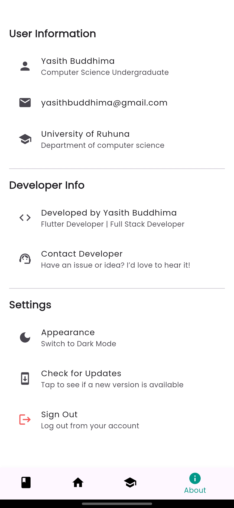

# GradMate

**Simplify your academic journey, you will.**

GradMate is a mobile app designed specifically for University of Ruhuna Computer Science students to organize their courses, monitor GPA, receive important notices, and celebrate milestones — all in one easy-to-use app.

With GradMate, managing your university life becomes less of a chore and more of a joy. Whether you're tracking course details or counting down to special academic moments, GradMate has your back.

> “Do or do not. There is no try.” — Yoda  
> _But with GradMate, you just do!_

---

## Installation Guide

Follow these steps to get the app on your device:

1. Download the appropriate APK file for your device (see the table below).
2. Enable installation from unknown sources in your Android settings.
3. Locate the downloaded APK and tap to install.
4. Open the app and enjoy organizing your academic journey!

| APK Version                   | Supported Devices                                | Recommended For              | Download Link                                                                                                        |
| ----------------------------- | ------------------------------------------------ | ---------------------------- | -------------------------------------------------------------------------------------------------------------------- |
| `app-release.apk`             | Universal (may be larger, supports most devices) | General use                  | [Download here](https://github.com/yasithbuddhima/GradMate/releases/download/v1.0.1/GradMate-universal-v1.0.1.apk)   |
| `app-armeabi-v7a-release.apk` | Older and 32-bit ARM devices                     | Most older phones            | [Download here](https://github.com/yasithbuddhima/GradMate/releases/download/v1.0.1/GradMate-armeabi-v7a-v1.0.1.apk) |
| `app-arm64-v8a-release.apk`   | Newer 64-bit ARM devices                         | Modern Android phones        | [Download here](https://github.com/yasithbuddhima/GradMate/releases/download/v1.0.1/GradMate-arm64-v8a-v1.0.1.apk)   |
| `app-x86_64-release.apk`      | Emulators or Intel-based devices                 | Testing or specific hardware | [Download here](https://github.com/yasithbuddhima/GradMate/releases/download/v1.0.1/GradMate-x86_64-v1.0.1.apk)      |

_If unsure which APK to install, `app-release.apk` is a safe all-around choice, but may be larger in size._

## 📑 Table of Contents

- [Features](#features)
  - [🎉 Onboarding Flow](#-onboarding-flow)
  - [🏠 Home Screen](#-home-screen)
  - [📣 Post Types (when content appears)](#-post-types-when-content-appears)
  - [📚 Courses](#-courses)
  - [🎯 Credits Page](#-credits-page)
  - [ℹ️ About Page](#-about-page)
  - [🔐 VIP Lounge (Admin Access)](#-vip-lounge-admin-access)
- [Screenshots](#screenshots)
  - [🔐 Onboarding & Sign-In](#-onboarding--sign-in)
  - [🏠 Home Screen & Posts](#-home-screen--posts)
  - [📚 Courses & Details](#-courses--details)
  - [ℹ️ About & Settings](#-about--settings)
- [🚀 Installation Guide](#-installation-guide)
- [📦 APK Variants Explained](#-apk-variants-explained)
- [👨‍💻 Developer Info](#-developer-info)
- [🧠 Questions? Feedback? New Ideas?](#-questions-feedback-new-ideas)
- [📜 License](#-license)

---

## Features

Welcome to **GradMate** 🎓 — your academic sidekick, built specially for University of Ruhuna Computer Science students. But with a little tweak, it’s ready to serve any uni, any degree, galaxy-wide.

> “Smart, your path becomes, when GradMate you use.” — _Yoda_

Here’s what makes GradMate awesome:

### 🎉 Onboarding Flow

- 3 beautiful intro screens guiding you in
- Google Sign-In only (no password headaches)
- First-time users add their birthday — 🎂 for special greetings later!

### 🏠 Home Screen

- Personalized welcome with your name, degree, and profile picture
- Placeholder with description and app intro until content arrives

### 📣 Post Types (when content appears)

1. **Notice Post** – Delivers updates
2. **Countdown Post** – Shows time left for major events
3. **Birthday Post** – Gender-neutral color-changing birthday cards that show up magically on the right day

### 📚 Courses

- All modules organized by year and semester
- Tapping a course opens detailed view with:
  - Course code, name, duration
  - Credits (the real kind)
  - Evaluation methods

### 🎯 Credits Page

- Degree requirements and GPA guide
- Credits breakdown, visualized nicely

### ℹ️ About Page

- Your profile: name, email, university, department
- Developer info with LinkedIn link
- Settings:
  - Toggle light/dark mode 🌗
  - Check for updates
  - Sign out

> “I turned myself into an academic planner, Morty. I’m GradMate Rick!” — _Rick Sanchez_

### 🔐 VIP Lounge (Admin Access)

- Long press dev name to unlock admin console:
  - Add/edit posts
  - View users
  - Add courses

---

## Screenshots

Feast your eyes on what awaits you in GradMate:

### 🔐 Onboarding & Sign-In

| Onboarding 1                                | Onboarding 2                                | Onboarding 3                                | Google Sign-In                    |
| ------------------------------------------- | ------------------------------------------- | ------------------------------------------- | --------------------------------- |
|  |  |  |  |

### 🏠 Home Screen & Posts

| Home (Empty)                             | Notice Post                            | Countdown                                    | Birthday Post                              |
| ---------------------------------------- | -------------------------------------- | -------------------------------------------- | ------------------------------------------ |
|  |  |  |  |

### 📚 Courses & Details

| Course List                         | Course Details                                   | Credits                             |
| ----------------------------------- | ------------------------------------------------ | ----------------------------------- |
|  |  |  |

### ℹ️ About & Settings

| About Page                      | Admin Console                   |
| ------------------------------- | ------------------------------- |
|  |  |

> “Clear your mind must be, and the UI will flow.” — _Yoda_

---

## 🚀 Installation Guide

1. **Download the correct APK for your device** from the [Releases](https://github.com/yasithbuddhima/GradMate-public/releases).
2. **Install the APK** on your Android phone (you may need to allow installs from unknown sources).
3. **Sign in using Google** – it’s the only login method supported (for now).
4. **Add your birthday** on the first launch, and you're in!

> “Sometimes science is more art than science, Morty.” — _Rick Sanchez_

---

## 📦 APK Variants Explained

There are multiple APKs to suit different phone architectures. Not sure what yours is? If your phone is recent (2018+), **arm64-v8a** is most likely the one. If you're unsure, just install the universal APK: `app-release.apk`.

| APK File                      | Description                                | Devices                       |
| ----------------------------- | ------------------------------------------ | ----------------------------- |
| `app-arm64-v8a-release.apk`   | Optimized for modern 64-bit Android phones | Most phones after 2018        |
| `app-armeabi-v7a-release.apk` | 32-bit support for older phones            | Older/low-end phones          |
| `app-x86_64-release.apk`      | For Android emulators and some tablets     | Emulators, some tablets       |
| `app-release.apk`             | Universal APK (includes all)               | Recommended for general users |

> “Pick the right APK, you must. Or crash you will.” — _Yoda_

---

## 👨‍💻 Developer Info

Developed with ❤️ by **[Yasith Buddhima](https://www.linkedin.com/in/yasithbuddhima/)**  
Student @ University of Ruhuna — Computer Science

- 📧 Email: yasithbuddhima@gmail.com
- 🌐 GitHub: [@yasithbuddhima](https://github.com/yasithbuddhima)

To access the **Admin Console**, long-press on the developer name inside the app. 🛠️

> “Judge me by my code, do you?” — _Yoda_

---

## 🧠 Questions? Feedback? New Ideas?

If something feels off, spooky 👻, or just out of this galaxy — let me know!  
Have a feature idea? I’d love to hear it.

Feel free to reach out via [email](mailto:yasithbuddhima@gmail.com) or [LinkedIn](https://www.linkedin.com/in/yasithbuddhima/).

> Why did Rick bring a ladder to school?  
> Because the grades were on another level!

---

## 📜 License

All rights are reserved by the developer. You may **download and use** the GradMate APK for personal, non-commercial use only.  
Redistribution, modification, or reverse engineering is **not permitted** without explicit permission.

> “Share your phone, not my code.” — _Rick, probably_
